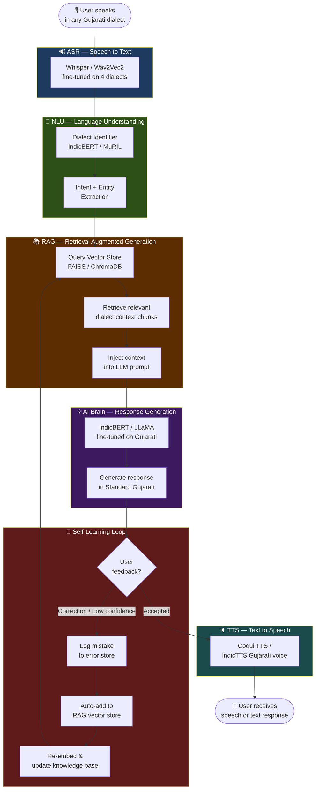

# 🗣️ Gujarati Cross-Lingual Voice Assistant

> A dialect-aware voice AI that understands regional Gujarati dialects, processes speech intelligently using RAG + LLM, and responds in voice or text. The model learns from its own mistakes continuously.

---

## 🔁 System Flow



---

## 🛠️ Tech Stack

| Layer | Tool | Purpose |
|---|---|---|
| **ASR** | `openai/whisper-small` | Speech → text, fine-tuned on Gujarati dialects |
| **ASR alt** | `facebook/wav2vec2-base` | Alternate ASR backbone |
| **Dialect ID** | `google/muril-base-cased` | Classify which dialect (Surti/Kathiawari etc.) |
| **Embeddings** | `sentence-transformers` | Encode text for RAG vector store |
| **Vector DB** | `FAISS` / `ChromaDB` | Store & retrieve dialect knowledge chunks |
| **LLM** | `ai4bharat/IndicBERT` | Core language understanding & generation |
| **LLM alt** | `LLaMA 3 (fine-tuned)` | Larger model for generation tasks |
| **TTS** | `Coqui TTS` / `IndicTTS` | Text → Gujarati speech |
| **Backend** | `FastAPI` (Python) | REST API for the pipeline |
| **Frontend** | `React` / `Next.js` | Web UI or mobile app |
| **Experiment tracking** | `MLflow` / `W&B` | Track model training runs |
| **Data** | `yt-dlp` + `youtube-comment-downloader` | Dialect data scraping |

---

## 📚 RAG Implementation

The model does **not** just rely on its weights — it retrieves real dialect knowledge at inference time.

```
User query
    ↓
Embed query using sentence-transformers
    ↓
Search FAISS/ChromaDB for top-k similar dialect chunks
    ↓
Inject retrieved context → LLM prompt
    ↓
LLM generates a context-grounded answer
```

**RAG knowledge base contains:**
- Dialect sentence examples (from our 2000 balanced rows)
- Dialect vocabulary mappings (Surti ↔ Standard Gujarati)
- Common corrections from the self-learning store

---

## 🔄 Self-Learning from Mistakes

When the model gets something wrong, it doesn't just fail — it learns:

```
Low confidence or user correction
    ↓
Error logged to mistake_store.json
    ↓
Re-embedded and added to RAG vector store
    ↓
Next identical/similar query uses corrected context
```

This means: **the more people use it, the smarter it gets**, without full retraining.

---

## 📊 Dialect Dataset (Phase 1 ✅)

| Dialect | Region | Balanced Rows |
|---|---|---|
| Standard Gujarati | Ahmedabad / Gandhinagar | 500 ✅ |
| Surti | Surat / South Gujarat | 500 ✅ |
| Kathiawari | Rajkot / Saurashtra | 500 ✅ |
| Charotari | Anand / Kheda | 500 ✅ |

**Total: 2,000 rows — 500 per dialect — equal class weight for unbiased training**

---

## 🗺️ Project Phases

| Phase | Goal | Status |
|---|---|---|
| **Phase 1** | Data collection & balancing (2000 rows) | ✅ Done |
| **Phase 2** | Dialect classifier (IndicBERT / MuRIL) | 🔜 Next |
| **Phase 3** | RAG pipeline setup (FAISS + embeddings) | 🔜 Planned |
| **Phase 4** | ASR fine-tuning (Whisper on dialect audio) | 🔜 Planned |
| **Phase 5** | LLM fine-tuning + TTS integration | 🔜 Planned |
| **Phase 6** | Self-learning loop (mistake → RAG update) | 🔜 Planned |
| **Phase 7** | FastAPI backend + React frontend / App | 🔜 Planned |

---

## 📁 Project Structure

```
├── README.md
├── .gitignore
├── docs/
│   ├── project_overview.md   ← detailed architecture doc
│   └── total_lang.csv        ← dialect reference
├── data/
│   ├── raw/                  ← dialect CSVs (500 rows each)
│   ├── processed/            ← tokenized / encoded data
│   └── combined/             ← train / val / test splits
├── scrapers/
│   ├── scrape_top4.py        ← 4-dialect YouTube scraper
│   ├── balance_data.py       ← balance to 500/dialect
│   ├── topup_gaps.py         ← fill shortfalls
│   └── dialect_cleaner.py
├── src/
│   ├── asr/                  ← Whisper fine-tuning
│   ├── nlu/                  ← dialect classifier + intent
│   ├── tts/                  ← Coqui/IndicTTS wrapper
│   └── api/                  ← FastAPI backend
├── models/                   ← saved checkpoints
└── notebooks/                ← experiments & EDA
```

---

*Version 2.0 | Updated: 2026-02-19*
