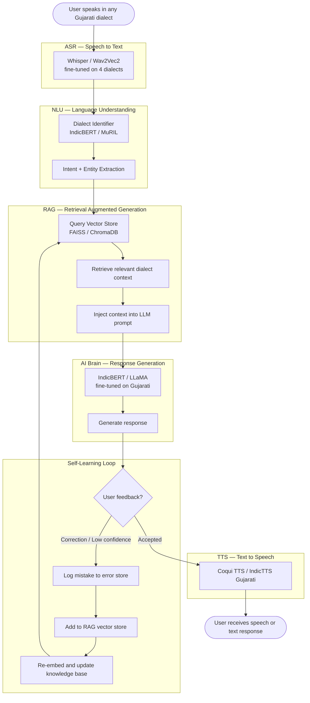

# Gujarati Cross-Lingual Voice Assistant

A dialect-aware voice AI that understands regional Gujarati dialects, processes speech using RAG + LLM, and responds in voice or text. The model continuously learns from its own mistakes.

---

## System Flow



---

## Tech Stack

| Layer | Tool | Notes |
|---|---|---|
| ASR | `openai/whisper-small` | Fine-tuned on Gujarati dialect audio |
| ASR (alt) | `facebook/wav2vec2-base` | Lower latency option |
| Dialect ID | `google/muril-base-cased` | 17 Indian languages pretrained |
| Embeddings | `sentence-transformers` | Multilingual, Gujarati-aware |
| Vector DB | `FAISS` / `ChromaDB` | Local and persistent RAG retrieval |
| LLM | `ai4bharat/indic-gpt` / `LLaMA-3-8B` | Response generation |
| TTS | `Coqui TTS` / `IndicTTS` | Gujarati speech synthesis |
| Backend | `FastAPI` | REST API for the pipeline |
| Frontend | `React` / `Next.js` | Web UI |
| Tracking | `MLflow` / `W&B` | Experiment tracking |
| Data | `yt-dlp` + `youtube-comment-downloader` | Dialect data collection |

---

## RAG

The model retrieves real dialect context at inference time rather than relying solely on trained weights.

```
User query
  -> embed with sentence-transformers
  -> search FAISS/ChromaDB for top-k dialect chunks
  -> inject retrieved context into LLM prompt
  -> LLM generates a grounded answer
```

The RAG knowledge base includes the 2,000 balanced dialect sentences, dialect vocabulary mappings, and corrections accumulated through the self-learning loop.

---

## Self-Learning from Mistakes

When the model produces a low-confidence or incorrect output, it logs the mistake and immediately updates the RAG store — no full retraining required.

```
Low confidence or user correction
  -> log to mistake_store.json
  -> re-embed the correction
  -> upsert into vector DB
  -> next similar query retrieves correct context
```

---

## Dataset

| Dialect | Region | Rows |
|---|---|---|
| Standard Gujarati | Ahmedabad / Gandhinagar | 500 |
| Surti | Surat / South Gujarat | 500 |
| Kathiawari | Rajkot / Saurashtra | 500 |
| Charotari | Anand / Kheda | 500 |

2,000 total — equal class weight, unbiased training.

---

## Phases

| Phase | Goal | Status |
|---|---|---|
| 1 | Data collection and balancing | Done |
| 2 | Dialect classifier (MuRIL) | Next |
| 3 | RAG pipeline setup | Planned |
| 4 | ASR fine-tuning (Whisper) | Planned |
| 5 | LLM + RAG integration | Planned |
| 6 | Self-learning loop | Planned |
| 7 | TTS integration | Planned |
| 8 | FastAPI backend + frontend | Planned |

---

## Structure

```
├── data/
│   ├── raw/            dialect CSVs, 500 rows each
│   ├── processed/      tokenized and encoded data
│   └── combined/       train / val / test splits
├── scrapers/           data collection and balancing scripts
├── src/
│   ├── asr/
│   ├── nlu/
│   ├── tts/
│   └── api/
├── models/             saved checkpoints
├── notebooks/          experiments and EDA
└── docs/               architecture and planning docs
```
